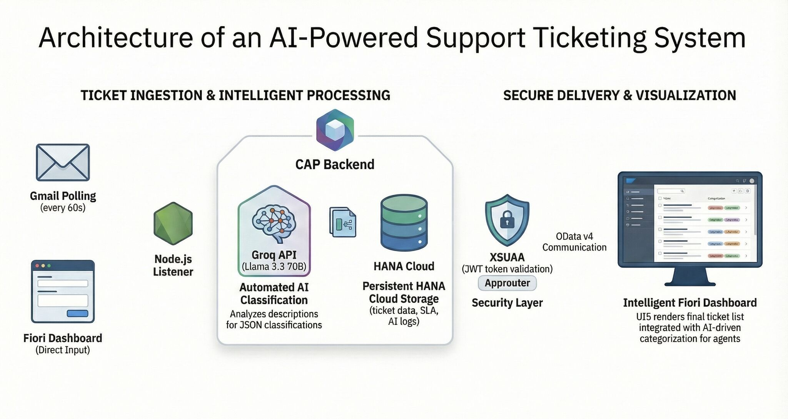
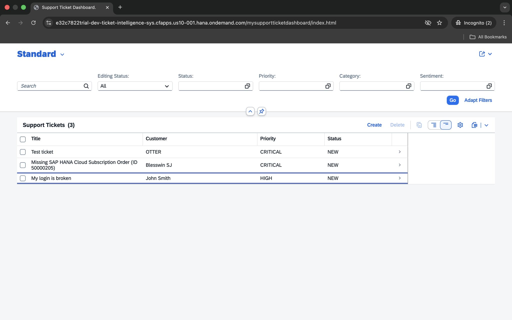
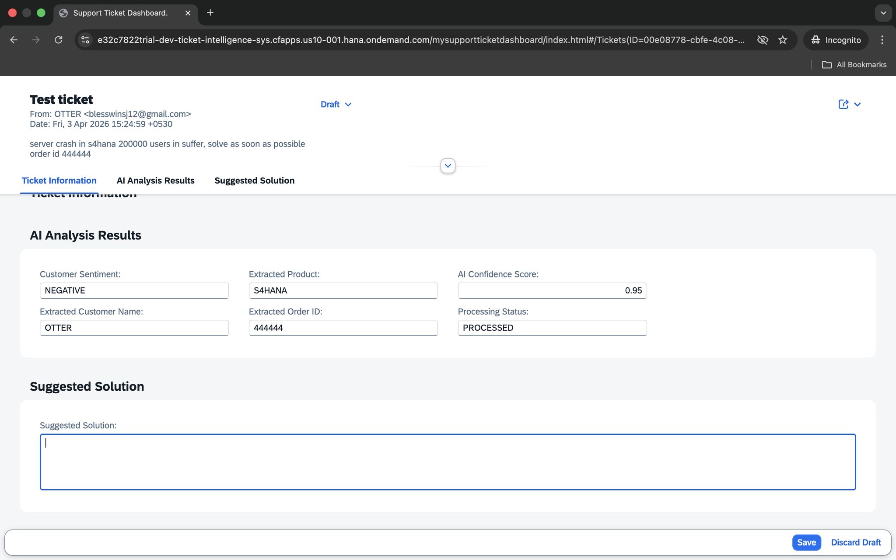

# AI-Powered Ticket Intelligence System — SAP BTP

A full-stack enterprise support ticketing application built on **SAP Business Technology Platform (BTP)**, integrating **Gmail API**, **SAP CAP (Node.js)**, **SAP HANA Cloud**, and **Groq LLaMA 3.3 70B** to automate the entire customer support lifecycle — from email ingestion to AI classification and resolution suggestions.

---

## Application Screenshots

### System Architecture


### Ticket Dashboard


### Ticket Details — AI Analysis


### AI Solution Recommendation


---

## How It Works

```
Gmail Inbox (every 60s poll)
        |
        v
Node.js Email Listener
        |
        v
CAP Backend
  - Parse email → create ticket
  - Send to Groq LLaMA 3.3 70B
  - AI classification + extraction
        |
        v
SAP HANA Cloud
  - Ticket data
  - SLA records
  - AI logs
        |
        v
XSUAA + Approuter (JWT validation)
        |
        v  OData V4
Fiori Dashboard (SAPUI5)
  - Ticket list with Priority / Status
  - Ticket detail with AI Analysis Results
  - Suggested Solution panel
```

Tickets can also be created manually through the Fiori dashboard as a direct input path, bypassing email ingestion.

---

## What the AI Extracts Per Ticket

For every incoming ticket, **Groq LLaMA 3.3 70B** analyzes the email body and returns:

| Field | Example |
|---|---|
| Priority | CRITICAL, HIGH, MEDIUM, LOW |
| Customer Sentiment | NEGATIVE, NEUTRAL, POSITIVE |
| AI Confidence Score | 0.95 |
| Extracted Product | S4HANA |
| Extracted Customer Name | OTTER |
| Extracted Order ID | 444444 |
| Processing Status | PROCESSED |
| Suggested Solution | (free-text recommendation) |

---

## Features

### Ticket Dashboard
- List report of all tickets with Title, Customer, Priority, and Status columns
- Filter by Status, Priority, Category, and Sentiment
- Real-time search across ticket titles
- Create and Delete actions

### Ticket Detail — Object Page
Three tabs per ticket:

**Ticket Information** — title, category, status, priority, full description, created at, created by

**AI Analysis Results** — sentiment, extracted product, customer name, order ID, AI confidence score, processing status

**Suggested Solution** — AI-generated resolution suggestion, editable draft field with Save / Discard Draft actions

### Email-Driven Automation
- Gmail API polling every 60 seconds via a Node.js listener
- Unread emails automatically parsed and submitted as new tickets
- Email metadata (From, Date) preserved in the ticket description

### Draft Ticket Management
- Tickets support a Draft state before submission
- Agents can edit AI-suggested solutions before saving

### Role-Based Access Control
- Administrator, Support Agent, and Viewer roles via XSUAA
- JWT token validation enforced through SAP Approuter

### SLA Tracking
- SLA records stored per ticket in HANA Cloud alongside AI logs

---

## Technology Stack

| Layer | Technology |
|---|---|
| Frontend | SAPUI5, SAP Fiori Elements (List Report + Object Page) |
| Backend | SAP CAP Node.js |
| AI Model | Groq API — LLaMA 3.3 70B |
| Email Integration | Gmail API (OAuth2, polling) |
| Database | SAP HANA Cloud |
| Authentication | XSUAA (JWT), SAP Approuter |
| OData | OData V4 |
| Deployment | SAP BTP Cloud Foundry, MTA |
| Event Handling | SAP Event Mesh (`event-mesh.json`) |

---

## Project Structure

```
.
├── app/                          # SAPUI5 frontend
├── db/
│   ├── data/                     # CSV seed data
│   ├── schema.cds                # CDS data model
│   └── undeploy.json
├── email-listener/               # Gmail polling service (Node.js)
├── srv/                          # CAP service handlers + AI integration
├── images/                       # Application screenshots
├── event-mesh.json               # SAP Event Mesh configuration
├── mta.yaml                      # MTA deployment descriptor
├── xs-security.json              # XSUAA role configuration
└── eslint.config.mjs
```

---

## Key Concepts Explored

- **Gmail API Integration** — OAuth2-based email polling with automatic ticket creation from unread messages
- **Groq LLaMA 3.3 70B** — Sending ticket descriptions to an LLM and parsing structured JSON classification results
- **SAP HANA Cloud Persistence** — Storing tickets, SLA data, and AI response logs in a managed HANA instance
- **XSUAA + Approuter Security** — Role-based JWT token validation across the full application stack
- **SAP Event Mesh** — Event-driven integration layer for decoupled service communication
- **MTA Deployment** — Multi-target application packaging for Cloud Foundry deployment
- **Draft-Enabled OData** — Supporting draft states for ticket editing before activation

---

## Roadmap

- [x] Gmail API polling and automated ticket ingestion
- [x] Groq LLaMA 3.3 70B classification and entity extraction
- [x] AI confidence scoring and sentiment analysis
- [x] Suggested solution generation
- [x] HANA Cloud persistence with SLA and AI logs
- [x] XSUAA role-based access (Admin, Agent, Viewer)
- [x] Cloud Foundry MTA deployment
- [ ] Ticket escalation workflow via SAP Build Process Automation
- [ ] SLA breach alerts via SAP Event Mesh
- [ ] Analytics dashboard for ticket volume and resolution trends

---

## Learning Outcomes

This project demonstrated how AI can be embedded into enterprise SAP BTP workflows — integrating an external LLM via REST API, handling email-driven event ingestion, managing role-based security with XSUAA, and persisting structured AI outputs in HANA Cloud — all within a production-style MTA-deployed CAP application.
